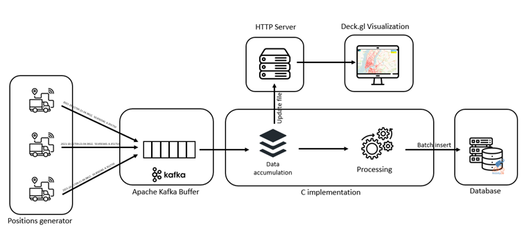

# Real-Time Deckgl Trajectory Visualization

July 2022

Instructions to configure the tools needed to use the real-time trajectory visualization in Deck.gl, this visualization work is part of the architecture described in the Master thesis "An architecture for real-time trajectory visualization in MobilityDB" by Alexandre Libert.

## Similarities with MobilityDB-Deck

The visualization part of this thesis share some similitude with [MobilityDB-Deck](https://github.com/MobilityDB/MobilityDB-Deck) done by Fabrício Ferreira during his Master Thesis.

His work focuses on the visualization in DeckGL of an existing dataset. While in this work we consider the production and visualization of data in real time.

# Introduction to a Real-Time Architecture for MobilityDB
The real-time architecture for MobilityDB is composed of multiple parts. First, a buffer made of Apache Kafka is created to capture all vehicle positions, followed by an application written in C for efficient memory usage. This application first reads the data from the buffer and makes it immediately available on a server from which the visualization application gets the data. Next, this data will be accumulated and processed in batches, since we have found in previous work that this method is more efficient than processing the data one by one. After that, some processing will be applied to the data, such as trajectory correction or simplification, whereas these steps are currently performed in the database. Then the data is stored in the database by batch insertion. Where, finally, more complex and time-consuming calculations can be performed. A second part of this architecture is the real-time visualization of vehicle trajectories, a front-end application performs this task using the Deckgl visualization framework that allows layers to be added on top of a map. For this application, a layer containing all trajectories was used

# Apache Kafka Buffer
Kafka is used as buffer for all the positions produced by vehicles, follow this [quickstart tutorial](https://kafka.apache.org/quickstart) to install Kafka. Then create a position topic, using this command:

    bin/kafka-topics.sh --create --topic positions --bootstrap-server localhost:9092

# Real-Time Processing in C
> Directory: ./C_Implementation

The C implementation prototype is made of three parts, an Apache Kafka Consumer loop based on the [Consumer example](https://github.com/edenhill/librdkafka/blob/master/examples/consumer.c) of the [librdkafka C/C++ library](https://github.com/edenhill/librdkafka). Then, a dynamic structure to store positions consumed from Kafka, this structure allows us to manipulate efficiently and perform some spatio-temporal transformation on these positions (not implemented, but we will be able to call MobilityDB functions on these data). And finally a part, to store the positions in a json file.

## Makefile Requirements
Ensure to provide the correct paths to the Makefile.base and LIBRDKAFKA Flags in the Makefile

## Compilation

    make consumer

## Execution

    ./consumer localhost:9092 test-consumer-group positions
Replace `test-consumer-group` by your Kafka Consumer Group
MEOS

# Data Generation

> Directory: ./dataset_scripts

The trips dataset used in this work is based on the  
[Deckgl TripsLayer example](https://deck.gl/examples/trips-layer/) based on the NYC Taxi & Limousine Commission Trip Records

## Trips Dataset Adaptation
[The trips dataset trips-v7.json](https://raw.githubusercontent.com/visgl/deck.gl-data/master/examples/trips/trips-v7.json) is processed in order to assign to each path a vehicleID. And extend trajectories to the size of TRAJECTORY_SIZE (120 by default), if the trajectory length is less than 120, the vehicle will do the same path backward

    python3 data_adapter.py tripsv7.json
trips_extended.json file  will be generated

## Positions Production
To simulate the emission of position by all the vehicles is done by the following Python script, each second, 996 position will be produced to Apache Kafka

    python3 json_to_kafka.py trips_extended.json 

The produced output respect this format

     {"vehicleID" : id , "path" : [[longitude, latitude], ... ], "timestamps" : [timestamp, ... ]}

# Real-Time Positions Server
> Directory: ./data_server

Actually, the last five positions are stored in a JSON file by the C implementation. (the actual implementation should be replaced by Kafka)

This server is based on the `cors_http_server.py` of [MobilityDB Deck](https://github.com/MobilityDB/MobilityDB-Deck/blob/main/geojsonvt/data/cors_http_server.py) 
## Configure Server

Configure the IP and Port of your server in cors_http_server.py

Make sure the ./C_Implementation/save_to_json.c file is configured to write to the ./data_server directory.

## Start Server

    python3 cors_http_server.py 

# Deckgl Visualisation 

> Directory: ./deckgl

The Deckgl implementation come as a React application. It requires node.js to run

## Configuration
Install the dependencies

    npm install

Replace this url with your positions server adress 

    fetch("http://localhost:8003/trips_last.json")

## Start DeckGL

    npm start

The map will open in web browser
